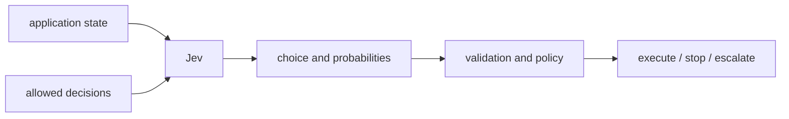
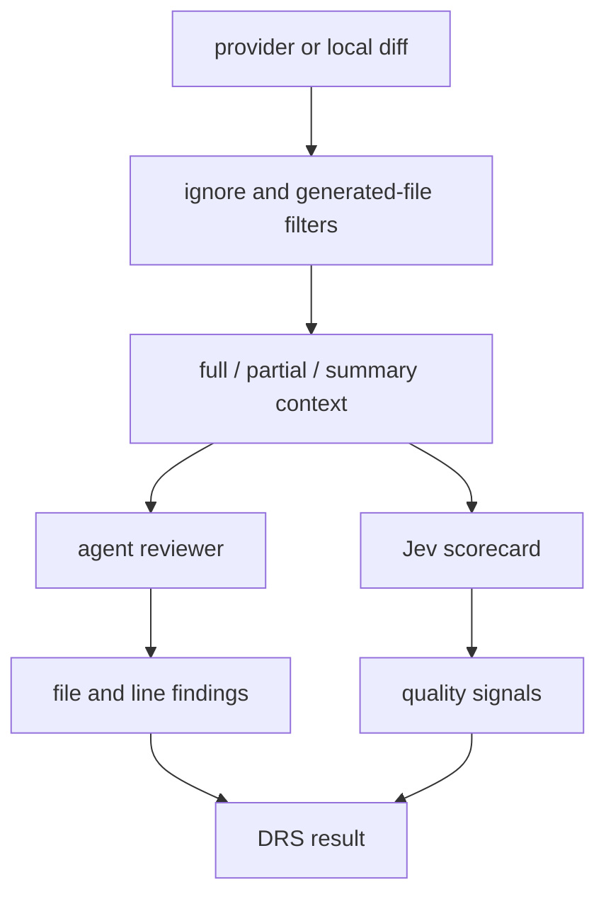

I already had an AI code reviewer. [DRS](https://github.com/manojlds/drs) reads a diff and writes file-and-line comments. It uses an LLM because explaining why a line is wrong is a language-generation problem.

Then I came across [TypeSafe's Jev](https://typesafe.ai/blog/introducing-system-one-models-and-jev), which has a very different interface:

> unstructured state in, typed probabilistic decisions out.

Jev does not write a review comment. You give it some state and a set of questions with bounded answers. It returns choices and probabilities. That made me wonder whether I could use it for the other half of code review: not explaining a bug, but deciding whether a change looks safe enough to merge.

I built that experiment twice. The first version makes Jev the merge gate. The second runs it beside the normal DRS reviewer. While I was doing that, two other projects appeared that use the same idea in less obvious places: choosing browser actions and composing user interfaces.

Those examples helped me understand Jev better than comparing it with another model architecture did. The interesting part is not whether Jev is a small LLM or a new kind of classifier. It is what happens when the model's output is an action space your program controls.

# The small amount of Jev you need to know

Jev exposes three question types:

| Primitive | Question | Result |
| --- | --- | --- |
| **Noul** | Is this proposition true? | `P(yes)` from 0 to 1 |
| **Choice** | Which of these options fits? | selected option and probability distribution |
| **Score** | Where does this sit on an ordered rubric? | weighted score and probability distribution |

A Noul can ask whether a diff contains a security concern. A Choice can select the primary risk from options I supplied. A Score can grade correctness against levels I defined.

Choice and Score responses also include a confidence derived from their probability distribution. I treat that as another policy input, not proof that the answer is correct. TypeSafe calls its training approach [Reinforcement Learning for Calibrated Decisions](https://docs.typesafe.ai/introduction/machine-learning-primer), but I have not measured Jev's calibration on code review. A probability in an API response is not, by itself, a production guarantee.

The useful boundary is simple:



Jev makes a judgment. My code decides what that judgment is allowed to do.

# First use: make Jev the merge gate

My standalone [jev-review](https://github.com/manojlds/jev-review) CLI collects a local Git diff, captures the task from commit messages or `--task`, asks Jev 23 questions, and applies a TypeScript policy.

The question pack contains seven quality Scores: correctness, test coverage, security, blast radius, reliability, changeability, and compatibility. Each has an applicability Noul, because a documentation change should not get a fake zero for test coverage. There are also three direct gate questions: `safe_to_merge`, `needs_human_review`, and `has_security_concern`.

In one run, `safe_to_merge` came back at `0.78` while `needs_human_review` was `0.72`. At first that looked contradictory. It is not: "this is probably safe" and "a person should still look" can both be true. The policy approves only when merge probability is high **and** the need for human review is low. It does not average the two into a mysterious overall score.

The more important lesson was how dependent those decisions were on the supplied context. A diff without the intended task asks the model to judge correctness against almost nothing. A large diff truncated at an arbitrary boundary can lose the tests while retaining the implementation. The model can return a perfectly valid, confident answer to an incomplete representation of the change.

The CLI therefore includes task intent, filters low-value files, and tries to keep source files with their tests. If the change still does not fit, it splits it into multiple Jev calls and combines their decisions conservatively. That slicing is a prototype policy rather than proof that cross-file relationships have been preserved.

This is enough to make the output useful as a visible, testable merge policy. It is not enough to make the hand-written thresholds a calibrated production gate.

# DRS: one prepared diff, two different jobs

In [DRS PR #205](https://github.com/manojlds/drs/pull/205), I gave Jev less authority. DRS now has three modes:

- `agent`: the existing issue-producing review;
- `jev`: a Jev quality scorecard without starting the agent runtime;
- `combined`: both evaluate the same prepared change independently.

DRS asks about 19 engineering dimensions. For each one, Jev decides applicability, assigns a 1-10 Score, and selects a possible weakness from a closed rubric. The agent still owns source-located findings. Jev's weakness text is shown as a hint to investigate, not converted into a made-up inline comment.

The interesting part is what happens before either reviewer runs.

DRS starts with the provider or local file list, applies the repository's ignore patterns, and removes files marked as generated. It then estimates the size of each patch and prepares one context in one of three modes:

- **full:** every available patch fits inline;
- **partial:** selected patches stay inline while omitted files remain as filenames with change statistics;
- **summary:** for a very large change, filenames and an omission summary remain but no patches are inline.

In combined mode, DRS uses the tighter context budget of the agent and Jev. Both receive the same prepared diff, which makes their outputs easier to compare and avoids quietly giving one reviewer better evidence than the other.

This is compression, not chunking. DRS makes one Jev request for the review. The agent can use repository tools to retrieve an omitted patch when it needs to make a file-specific claim; remote Jev cannot. For Jev, anything left out of that one request is unavailable.



The Jev state contains the review task, the prepared diff, the compression summary, and bounded metadata such as repository, title, description, and refs. It does not contain the whole repository. It is also sent to a remote service, so selecting less context is both a token-budget decision and a privacy decision.

Provider APIs add another constraint: GitHub and GitLab can omit patches for binary, collapsed, or oversized files. DRS preserves those filenames and tells Jev that the inline patch is missing, but a filename is not evidence about the implementation. The amount and shape of context passed to Jev directly limits what its 19 scores can mean.

That is why Jev remains advisory in DRS. A high Score cannot override failing tests or an agent finding, and it does not set merge status. The scorecard describes the evidence supplied to the evaluator, not unseen parts of the repository.

# The surprising use: a browser action is also a Choice

[Browser Use's `jev-ultrafast`](https://github.com/browser-use/jev-ultrafast) made the abstraction click for me.

A browser agent repeatedly has to answer two bounded questions:

1. What operation should happen next?
2. Which visible element should receive it?

`jev-ultrafast` takes a DOM snapshot and turns the visible controls into an indexed table. The operation is a Choice among `CLICK`, `TYPE_TEXT`, `SELECT`, scrolling, waiting, `DONE`, and `BLOCKED`. Operations that need an element, such as `CLICK` and `TYPE_TEXT`, get another Choice containing only compatible targets.

The clever part is that Jev evaluates the operation and speculative target questions in one request. If it selects `CLICK`, the program uses only `click_target`; the unused target answers cannot execute anything. The executor then resolves the selected index back to an observed DOM node and rechecks page freshness, geometry, and occlusion before acting.

```text
page -> indexed controls -> Jev: operation + possible targets -> validated browser action
                                      |
                                      +-> small LLM only when text must be written
```

Jev does not generate CSS selectors, coordinates, JavaScript, or text to type. A small LLM is called only after Jev chooses `TYPE_TEXT`. This is a useful hybrid: bounded decisions stay bounded, while open-ended generation is paid for only when the task actually needs a new string.

The repository shows a Google Flights task completing in 7.073 seconds, measured from the first prediction after the initial page observation until Jev selected `DONE`. Browser setup, initial navigation, and the independent post-run check are outside that clock. Its small matched comparison reports a median improvement from 9.450 to 7.092 seconds, with all three runs in each arm passing the result check. Median Jev latency in the recorded run was 178 ms.

Those numbers are interesting, but "Jev made browser agents fast" would be too simple. The optimized version also replaced repeated accessibility-tree reads with one DOM snapshot, cut median browser protocol calls from 1,092 to 101, used short event-based waits, and avoided screenshots in the decision loop. It still made 17 Jev requests and sent about 90,000 input tokens for one flight search. The authors are explicit that three pairs on one task are not a general browser-agent benchmark.

# Generative UI without generating the UI

The experimental [Jev integration in `json-render`](https://json-render.dev/docs/jev) applies the same pattern to interface composition. [The demo describes it](https://x.com/i/status/2101022101750571357) as generative UI rendered in milliseconds.

`json-render` already constrains AI output to a catalog of components and actions. In the Jev experiment, the application goes further and supplies concrete candidates: a configured panel, a particular name field, a Save button with an allowed action, or two prepared chart variants. Jev chooses which candidates to include, which one is the root, their order, and where they are placed.

For a new tree, the default batched strategy uses one evaluation to select the root and required components, then a second evaluation to arrange them when necessary. The result is validated and rendered through the normal `json-render` registry.

The constraint matters here too. Jev cannot invent a heading, write button copy, or produce missing business data. Those values have to exist in the candidate set, state, or another generation step. It is composing from prepared UI pieces, not generating arbitrary JSON token by token.

That makes the "instant generative UI" claim more understandable. If the components, props, bindings, and actions already exist, the remaining problem is mostly selection and arrangement. But this integration is currently unreleased and explicitly experimental. Its documentation says a valid completed spec is not a correctness guarantee, and I have not seen a published benchmark behind the broader "milliseconds" claim. I would treat the demo as a promising interaction pattern, not a settled performance result.

# The pattern behind all three examples

Code review, browser control, and UI composition look unrelated. In these projects they reduce to the same loop:

1. Build a useful state from the world.
2. Construct the options the model is allowed to choose.
3. Ask several bounded questions, sometimes speculatively in one request.
4. Validate the selected answer against the current state.
5. Let ordinary code execute, reject, or escalate it.

This is where Jev feels different in practice. The question pack is not merely a prompt asking for nicer JSON. It is an API boundary and an authority boundary. In the browser example, an answer can reference only an observed element. In `json-render`, it can select only a prepared component candidate. In my merge gate, it can trigger only one of four policy outcomes.

The failures are also similar. If the DOM snapshot misses a control, the browser agent cannot choose it. If a UI candidate does not contain the required text, Jev cannot invent it. If a diff omits a deleted file, the review scorecard cannot judge that deletion. Better probabilities do not repair missing state.

That is my main lesson from these experiments: **state construction and action-space design are part of model correctness**.

Jev still needs independent checks around consequential actions. The browser demo verifies the final route and date rather than trusting `DONE`. A UI action still needs server-side authorization and validation. A merge decision still needs tests and repository policy. Typed output removes a class of parsing problems; it does not remove the need to verify what happened.

# Try the code-review prototype

```bash
git clone https://github.com/manojlds/jev-review
cd jev-review
pnpm install
export TYPESAFE_API_KEY=... # https://console.typesafe.ai/
pnpm review --output jev-review.md
```

`--commit HEAD` reviews one commit and uses its message as the task. `--base main` reviews the current tracked work against `main`. `--task` supplies explicit intent, and `--json` produces machine-readable output.

Exit code `0` means approve or non-blocking comment, `1` means request changes or a tool failure, and `2` means escalate. These are prototype defaults, not universal merge policy.

Start with [`src/questions.ts`](https://github.com/manojlds/jev-review/blob/main/src/questions.ts) and [`src/policy.ts`](https://github.com/manojlds/jev-review/blob/main/src/policy.ts). The first defines what Jev is allowed to decide. The second defines what the program does about it.
