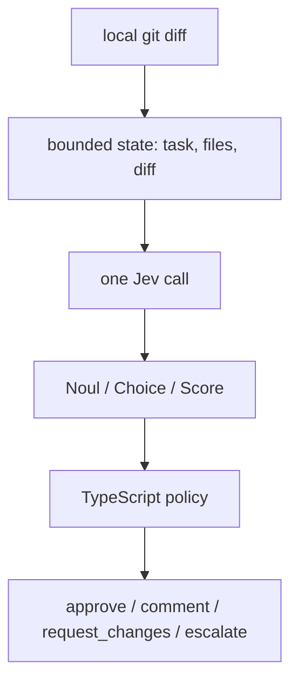
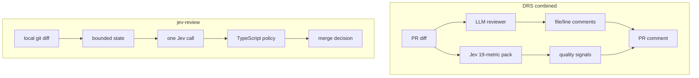
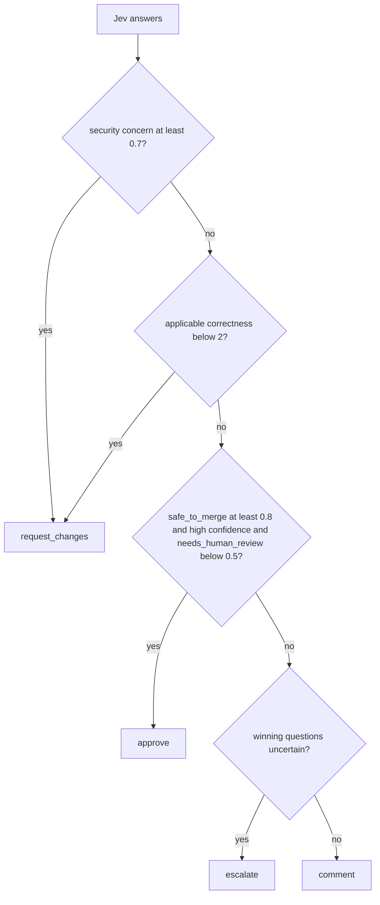

I already have a code reviewer. [DRS](https://github.com/manojlds/drs) is an agent that reads a diff and writes comments. That's the usual shape now: dump the change into a chat model, hope the prose is useful, maybe paste it on a PR.

[TypeSafe's Jev](https://typesafe.ai/blog/introducing-system-one-models-and-jev) is not that.

Jev is a **System One** model: unstructured state in, typed probabilistic decisions out. It does not generate strings. You send it a blob of state plus a pack of questions, and it answers all of them in parallel as one of three primitives:

- **Noul** — P(yes) in `[0, 1]`. A fuzzy `if`.
- **Choice** — one option from a closed set, plus the full distribution and a confidence.
- **Score** — a position on an ordered rubric you wrote.

The TypeScript around that call is the System Two. That's the whole product: decompose a judgment into atomic questions, compose the answers in code, and treat **confidence** as a second axis (auto / look / escalate).

So I wanted a prototype where Jev *is* the reviewer, not a sidecar that slaps a 82/100 on an LLM essay. Local git diff. One function call. Policy in code. A merge decision, not a comment.

The CLI is [jev-review](https://github.com/manojlds/jev-review).

# Review as a gate, not an essay

A chat model is good at "here's why this line is wrong." It is a bad merge gate. The output is prose. You can't threshold prose. You can't unit-test prose. You definitely shouldn't `exit 1` because a paragraph felt negative.

A merge gate needs questions like:

- Is there a **concrete** security issue in this diff, not a hypothetical one?
- How correct is this relative to the task?
- Are the tests covering the changed behavior, or is there nothing to judge?
- What's the primary risk, if any?

Those are Nouls, Scores, and Choices. Jev answers them. Policy decides.



I had already bolted Jev onto DRS ([PR #205](https://github.com/manojlds/drs/pull/205)): 19 quality dimensions, each with applicability + score + weakness, hanging next to the agent. That integration is real, and it hid the interesting part. The scorecard was optional color around an LLM review. The standalone CLI makes the composition the product.



DRS still writes the essay. This CLI does not. If you want "why is this line wrong?", use DRS. If you want "is this mergeable, and how sure are we?", use Jev.

# The question pack is small on purpose

There's another [jev-review](https://github.com/NiazMorshed2007/jev-review) in the wild that's a quality loop for a coding agent: nineteen dimensions, 1–10 scores, a weakness choice per metric. That's ~57 questions. Fine for an agent iterating on its own code. It's the wrong pack for a merge gate.

I started with four scores (correctness, test coverage, security, blast radius), three merge gates, and a couple of classifications. Then I stole three more merge-relevant dimensions and stopped:

| Score | Higher means |
| --- | --- |
| correctness | the change does what the task says |
| test_gap | tests cover the changed behavior |
| security | less new exposure |
| blast_radius | **more** impact elsewhere |
| reliability | failure paths are handled |
| changeability | the next conceptual edit is local |
| compatibility | existing contracts still hold |

Blast radius is "what else breaks **now**." Changeability is "how hard is the **next** edit." Compatibility is conditional: if the diff doesn't touch a public API, migration, or integration, the score is `n/a`, not a fake 4.

Each score has an applicability Noul. Jev still answers the score (speculative fan-out). Policy uses it only when applicability is at least 0.5. A docs-only change does not fail because test coverage scored 0. Missing evidence is not a zero.

The merge gates stay independent of the scores:

- `safe_to_merge`
- `needs_human_review`
- `has_security_concern`

That independence is not a bug. I stared at a report where `safe_to_merge` was 0.78 and `needs_human_review` was 0.72 and thought: if a human should look, how is it safe?

Because they are different questions. "Probably fine to merge" and "a person should glance at this" can both be true. Policy encodes that: approve only if `safe_to_merge` is high **and** `needs_human_review` is low. Mid on both is `comment`, not `approve`.

# Policy is the reviewer

Thresholds live in TypeScript so they can change without rewriting prompts.



`escalate` is not a hard block. It means "the probabilities are too close to 0.5 to act." Exit code 2. A CI job can page a human instead of pretending it knows.

The new scores (reliability, changeability, compatibility) are **comment caveats**, not merge blocks. A 2.5 on changeability should not `request_changes`. A concrete security Noul should.

# A real run

I pointed the CLI at its own commit that added those three scores. Jev saw the commit message as the task, the patch as the state, and came back with:

**Decision:** `comment`
**Rule:** `mergeable_with_caveats`

- `safe_to_merge` 0.78 — close to approve, not over the line
- `needs_human_review` 0.72 — so policy would not have approved anyway
- `has_security_concern` 0.29 — no security gate
- correctness 3.7, tests 3.0, security 3.4
- blast radius 1.0 — local
- changeability 2.5 — "next edit is hard", and that's the caveat the rule cited
- compatibility **n/a** — adding review dimensions is not a public API change
- `change_kind` feature, 100%
- 12,439 input tokens, 695 output

That's the shape I wanted. Not "here's a paragraph about your abstraction." A decision, which rule fired, and a scorecard you can argue with.

The report also prints the **captured task**. Early runs used a generic fallback ("review this diff") and Jev reasonably scored things against nothing. Local git reviews now take the commit message(s) for the range. `--task` overrides the intent; the git messages still go along as extra state.

# Context is a packing problem

Jev's request budget is about 32k tokens for the whole call. The first live run on this repo blew that immediately: lockfiles. So the CLI ignores lockfiles, images, wasm, and whatever you put in `jev-review.config.json`.

The next failure mode is a huge *source* diff. Dumping the tree and truncating the tail is how you silently drop tests. Asking Jev to classify "important files" first is how you underweight tests on purpose.

The packer estimates tokens (~3 characters per token), reserves ~12k for the 23-question pack, groups each source file with its tests, and splits into slices only if it still doesn't fit. Slice decisions combine conservatively: any `request_changes` or `escalate` wins; `approve` only if every slice would approve. Scores are not averaged. The report lists each slice.

The SDK does not have a client-side token counter. You find out the real usage after the call. The estimate is deliberately pessimistic.

# What I am not doing

This is not DRS. No PR comments, no GitHub Action, no file:line findings.

This is not a 19-metric quality dashboard. Readability, maintainability, performance-as-a-score — those help an agent iterate. They don't belong on `approve`.

Jev will not tell you *why* a line is wrong. The scorecard says "diagnose causes in the diff before changing code" because that's your job, or DRS's job. System One classifies. System Two (you, or an LLM) explains.

# Try it

```bash
git clone https://github.com/manojlds/jev-review
cd jev-review
pnpm install
export TYPESAFE_API_KEY=...    # early access: https://console.typesafe.ai/
pnpm review --output jev-review.md
```

`--commit HEAD` reviews that commit's patch and uses its message as the task. `--base main` includes uncommitted work. `--json` if you want to pipe it.

Exit codes: `0` approve or comment, `1` request changes, `2` escalate.

The interesting file is [`src/policy.ts`](https://github.com/manojlds/jev-review/blob/main/src/policy.ts). The questions are the API. The policy is the reviewer.
