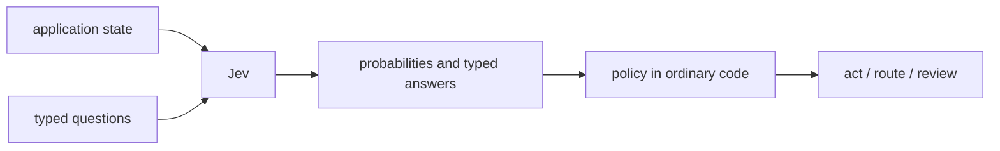
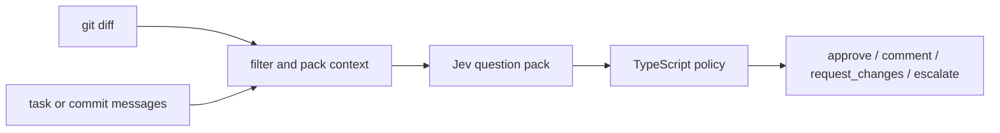
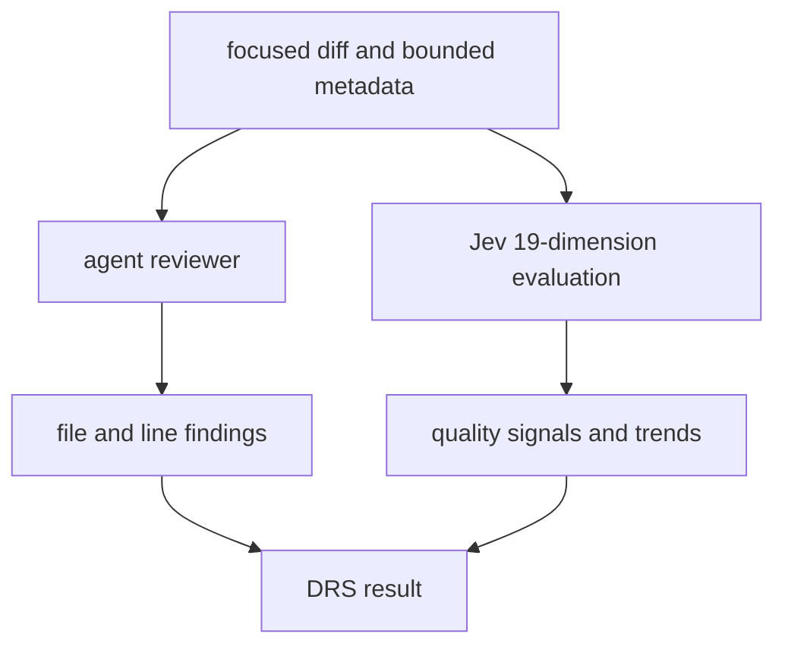

Most AI applications begin with a prompt and end with text. Even when the program really needs a decision, we ask a language model to write a response and then parse that response back into something code can use.

[TypeSafe's Jev](https://typesafe.ai/blog/introducing-system-one-models-and-jev) starts with a different interface:

> unstructured state in, typed probabilistic decisions out.

Jev is TypeSafe's first **System One model**. It accepts text or structured text state, evaluates a set of predefined questions, and returns bounded answers with probabilities. It does not write an explanation, generate code, or invent another output shape.

That makes Jev less like a chatbot and more like a semantic function call.



The model supplies judgments. Your code still owns control flow, thresholds, side effects, and the final decision.

# Three question types

Jev exposes three primitives. They can be mixed in one request and are evaluated independently against the same state.

| Primitive | Use it for | Returned value |
| --- | --- | --- |
| **Noul** | A yes/no proposition | `P(yes)` from 0 to 1 |
| **Choice** | One option from a closed set | winner, distribution, confidence |
| **Score** | A position on an ordered rubric | weighted score, distribution, confidence |

A Noul is a fuzzy boolean. "Does this ticket request a refund?" might return `0.93`, rather than only `true`.

A Choice asks Jev to select among options you define. A support router might choose `billing`, `technical`, or `account`, while preserving the probability assigned to every option.

A Score is not an arbitrary number. You provide ordered descriptions such as `calm`, `frustrated`, and `very angry`; Jev returns a probability-weighted position over those levels.

Choice and Score answers also include a confidence derived from the shape of their probability distribution. Nouls expose the probability directly. These are related signals, but not identical fields on every primitive.

This distinction matters. The answer tells the program **what** Jev currently favors. Confidence tells the program whether it should act, gather more context, or escalate.

# Jev, LLMs, and BERT solve different interface problems

It is tempting to describe every model that understands text as a smaller or larger LLM. That is not a useful comparison here.

## Compared with a generative LLM

A generative LLM has an open-ended output space. That is exactly what you want for explanations, code, summaries, and conversation. Modern LLMs can also produce JSON or call tools, so "LLMs only return prose" would be wrong.

The difference is the native contract. With an LLM, structured output is a constraint around a text generator. The application usually needs a schema, validation, retries, and a policy for malformed or semantically inconsistent output. Jev is trained and served for closed decisions and probabilities instead of string generation. TypeSafe calls its training approach [Reinforcement Learning for Calibrated Decisions](https://docs.typesafe.ai/introduction/machine-learning-primer).

Calibration is a property across many predictions, not a promise that one answer is correct. If predictions assigned `0.8` are well calibrated, roughly 80 percent of that group should be correct. A single `0.8` can still be wrong.

| | Generative LLM | Jev |
| --- | --- | --- |
| Native output | Tokens / text | Closed typed decisions |
| Best fit | Explain, create, converse, reason in the open | Classify, score, route, verify |
| Possible answers | Open-ended | Defined by the caller |
| Uncertainty | Often added through prompting or application logic | Probabilities are part of the response |
| Application role | Can propose both reasoning and action | Supplies signals to code-owned policy |

This is not an intelligence leaderboard. It is a choice of abstraction. A code-review comment needs language generation; a low-latency routing decision may not.

## Compared with BERT-style classifiers

[BERT](https://arxiv.org/abs/1810.04805) is a pretrained bidirectional text encoder. The classic deployment pattern adds or fine-tunes an output head for a task such as sentiment, entailment, or intent classification. That can be excellent when you own a stable task, training data, evaluation set, and model-serving stack.

Jev exposes a hosted, request-defined decision API instead. The caller describes a Choice, Score, or Noul at runtime and supplies the state to evaluate. I do not need to train and deploy a new classification head for every question pack.

| | BERT-style classifier | Jev |
| --- | --- | --- |
| Task definition | Usually fixed by training/fine-tuning and an output head | Supplied as questions in each request |
| Operation | Run a model built for a known label space | Ask new bounded questions over supplied state |
| Ownership | Commonly self-trained or self-hosted | Hosted API and SDK |
| Good fit | Stable, high-volume task with representative labeled data | Rapidly changing semantic decisions composed in software |

This comparison is about how an application uses the model, not Jev's undisclosed internal architecture. It would be speculation to call Jev "BERT with dynamic labels" or to claim that one approach is universally more accurate. A trained classifier may be the better system for a narrow, mature task. Jev is interesting when the decision changes faster than a conventional train-and-deploy cycle.

# Calling Jev

The JavaScript SDK makes the contract concrete:

```ts
import { choice, noul, score, TypeSafeClient } from "@typesafe-ai/sdk";

const client = new TypeSafeClient(); // reads TYPESAFE_API_KEY

const response = await client.systemOne({
  state: {
    ticket: "I was charged twice and need this fixed today.",
    plan: "business",
  },
  questions: {
    department: choice("Which team should handle this ticket?", {
      billing: "Payment, invoice, or subscription issue",
      technical: "Product failure or integration issue",
      account: "Login, identity, or account-management issue",
    }),
    urgency: score("How urgent is the request?", [
      "No time pressure",
      "Time-sensitive but not blocking",
      "Immediate business impact",
    ]),
    duplicateCharge: noul("Does the ticket report a duplicate charge?"),
  },
});

const department = response.answers.department;

if (department.confidence < 0.5) {
  routeToHuman(response);
} else if (department.choice === "billing") {
  routeToBilling(response);
}
```

The important design work is not constructing the client. It is:

- putting enough relevant evidence in `state`;
- asking atomic questions rather than one vague mega-question;
- defining options and score levels that do not overlap;
- choosing thresholds from tests on your own data;
- deciding what happens when the model is uncertain.

You can try the [TypeSafe playground](https://console.typesafe.ai/playground), call `POST /v1/systemone`, or use the JavaScript and Python SDKs. Jev is a remote service, so the state leaves your process; privacy, retention, and trust-boundary decisions belong in the design, not as an afterthought.

# Where the interface fits

The common shape is a semantic decision inside a deterministic workflow:

- classify support tickets, documents, transactions, or user intent;
- route work to a team, tool, specialist model, or human;
- score relevance, severity, risk, or quality against an explicit rubric;
- verify citations, policy compliance, tool calls, or another model's output;
- rank or filter retrieval candidates;
- extract probabilistic features for a downstream model;
- moderate content with separate severity and confidence thresholds;
- apply semantic lint rules that ordinary syntax-based tools cannot express.

Jev is not the whole application in any of these examples. A fraud workflow still needs transaction rules. A moderation system still needs policy and appeals. A verifier still needs to decide what evidence is sufficient.

It is also not a replacement for generation. If the output must be a useful explanation, a patch, an email, or an open-ended investigation, use a generative model or a person. Jev can classify or route that work, but it does not produce it.

# Experiment one: a merge gate

Code review gave me a useful test because it needs both kinds of intelligence:

- open-ended diagnosis: find a bug and explain the affected line;
- bounded judgment: estimate risk and decide whether automation should proceed.

I built [jev-review](https://github.com/manojlds/jev-review) to test the second half without an LLM reviewer. It collects a local Git diff, captures the intended task, asks Jev 23 questions, and applies a deterministic TypeScript policy.



The pack contains:

- seven applicability Nouls;
- seven 0-4 Scores for correctness, test coverage, security, blast radius, reliability, changeability, and compatibility;
- three Choices for concrete weaknesses;
- three gate Nouls: `safe_to_merge`, `needs_human_review`, and `has_security_concern`;
- three classifications for change kind, primary risk, and review focus.

Applicability prevents missing evidence from becoming a fake zero. A documentation-only change should not fail because test coverage is inapplicable. Jev evaluates the candidate score in parallel, but the policy ignores it when the paired applicability probability is below `0.5`.

The final action is ordinary code. A strong security signal or low applicable correctness can request changes. High merge probability, sufficiently confident Scores, and low need for human review can approve. Ambiguous key signals escalate rather than guess. Everything else produces a non-blocking comment result.

Large diffs make the experiment less tidy. The CLI ignores configured low-value files, estimates a context budget, tries to keep source with tests, and makes one Jev call per slice when needed. The worst slice decision wins; Scores are not averaged. An oversized individual file can still be truncated, so "reviewed" never means "the model saw the repository."

There are important prototype limitations:

- the thresholds are hand-written policy, not calibrated merge guarantees;
- Jev returns risk signals, not file-and-line diagnoses;
- incomplete state can produce a confident answer to the wrong representation of the change;
- slicing can hide relationships between files in different calls;
- untracked files and unusual diffs need particularly careful collection;
- a typed answer is structurally valid, not necessarily semantically correct.

The checked-in SQL-injection fixture is a good illustration of the output shape: its sample report requests changes because `has_security_concern` crosses the configured threshold. It is an offline fixture, not evidence that this policy is ready to approve production changes unattended.

# Experiment two: Jev beside an agent in DRS

[DRS](https://github.com/manojlds/drs) explores the other composition. DRS is a workflow-first code-maintenance tool with an agent-backed reviewer. [PR #205](https://github.com/manojlds/drs/pull/205) added three review modes:

- `agent`: the existing issue-producing review;
- `jev`: a Jev scorecard without starting the agent runtime;
- `combined`: both run independently over the same focused diff.

DRS asks a broader pack: 19 engineering dimensions, each with applicability, a 1-10 Score, and a weakness Choice. That produces quality signals and coarse priorities, not source-located findings.



DRS deliberately keeps the outputs separate. A Jev weakness is rendered as a rubric hint, not converted into an invented inline comment. A high Score cannot override failing tests, unresolved findings, or project policy. In Jev-only mode, an empty `issues` array means no issue-producing reviewer ran; it does not mean the diff is clean.

The platform integration adds things the standalone CLI does not: GitHub and GitLab workflows, sanitized artifacts, retries, read-only Jev workflows, and first-run PR/MR baselines for per-dimension trends. It also has a larger security boundary because focused patches and bounded change metadata are sent to a remote API from CI.

# What the two experiments taught me

The two implementations use the same model but assign it different authority.

| | `jev-review` | DRS |
| --- | --- | --- |
| Role for Jev | Primary merge signal | Independent quality evaluator |
| Output | Four-way policy decision and scorecard | Advisory scorecard and trends |
| Explanations | No file/line findings | Agent produces actionable findings |
| Input | Local diff, commit/range, or patch | Local, GitHub PR, or GitLab MR workflow state |
| Large changes | Multiple conservatively combined slices | Shared filtering and context compression |
| Automation | Exit code can gate CI | Jev does not set merge status in v1 |

The standalone tool makes policy easy to see and test, but every threshold becomes consequential. The DRS integration is safer about authority, but a broad scorecard is easier to admire than to act on.

Both exposed the same deeper problem: **state construction is part of model correctness**. If a patch is missing, the task is stale, or relevant files are compressed away, no question wording recovers the evidence. Probability communicates the model's uncertainty about the state it received, not whether your application assembled the right state.

That is why I now think of Jev as neither "a tiny LLM" nor "a classifier API." The useful abstraction is a programmable set of probabilistic judgments. Jev handles those judgments; code composes them; an LLM or human can investigate when the workflow needs an explanation.

# Try the code-review prototype

```bash
git clone https://github.com/manojlds/jev-review
cd jev-review
pnpm install
export TYPESAFE_API_KEY=... # https://console.typesafe.ai/
pnpm review --output jev-review.md
```

`--commit HEAD` reviews one commit and uses its message as the task. `--base main` reviews the current tracked work against `main`. `--task` supplies explicit intent, and `--json` produces machine-readable output.

Exit code `0` means approve or non-blocking comment, `1` means request changes or a tool failure, and `2` means escalate. Treat those defaults as prototype policy, not universal truth.

Start with [`src/questions.ts`](https://github.com/manojlds/jev-review/blob/main/src/questions.ts) and [`src/policy.ts`](https://github.com/manojlds/jev-review/blob/main/src/policy.ts). The first file defines what the model is allowed to decide. The second defines what the software does about it. That boundary is the point.
