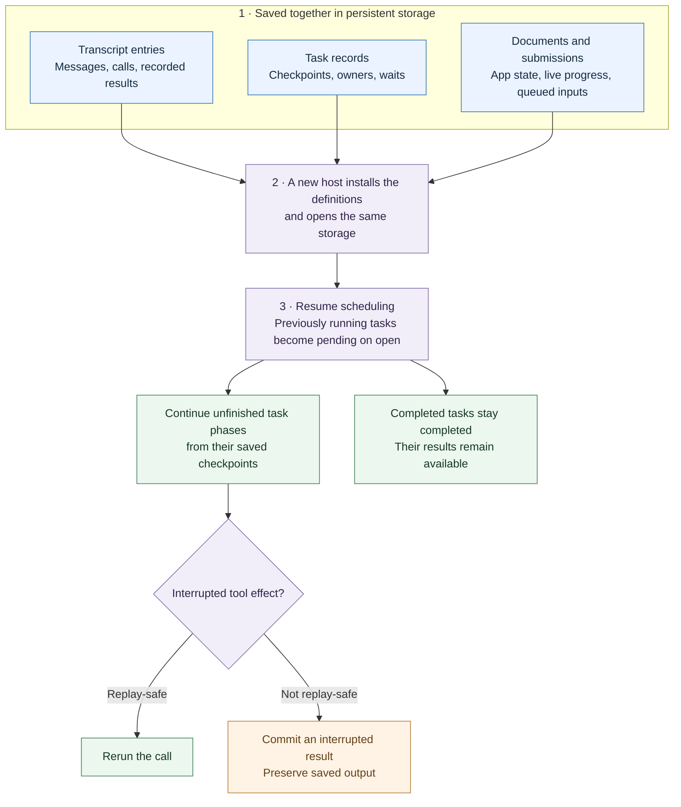
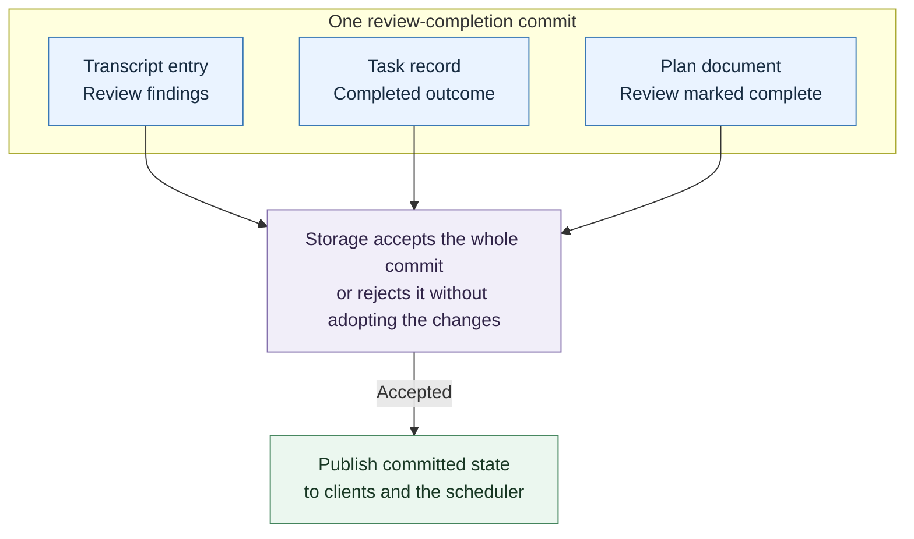
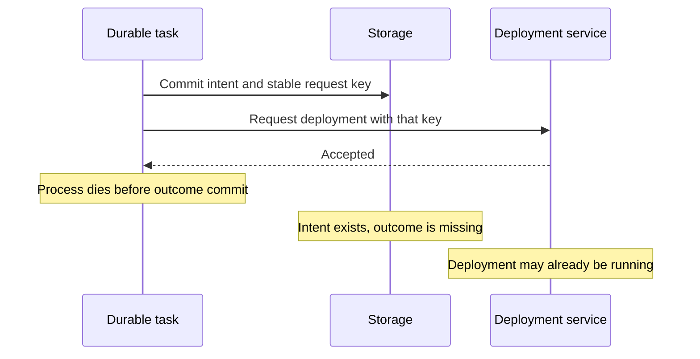
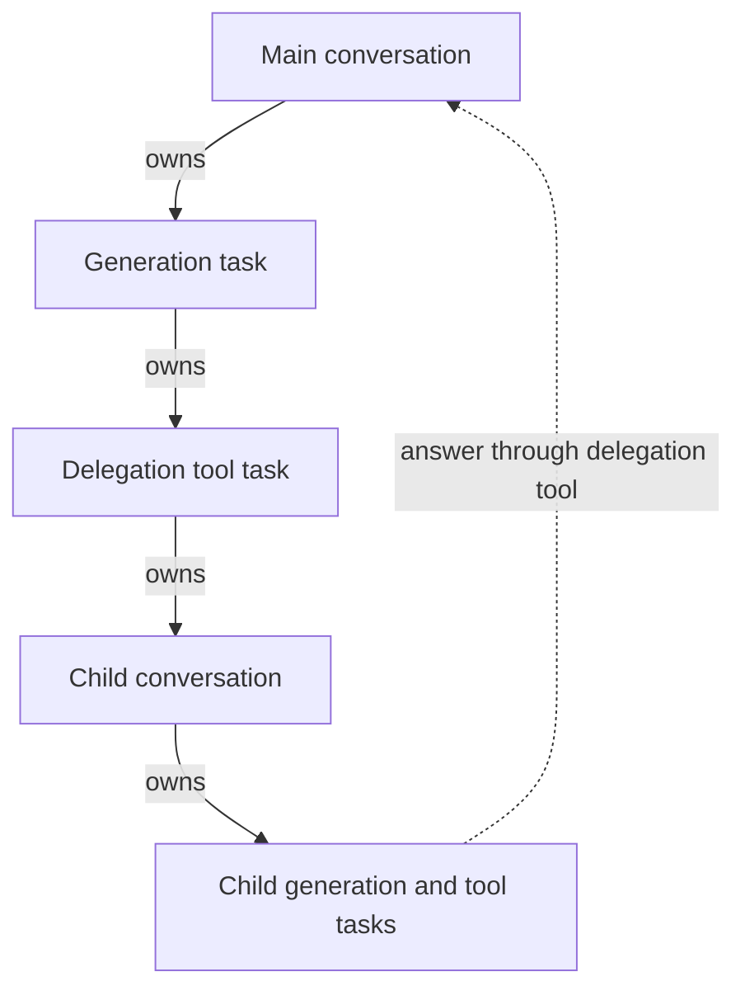

[Pi Durable](https://earendil.com/posts/pi-durable/) was released alongside Pi 1.0 on October 1. I was excited to try it out and spent some time experimenting with tasks, persisted state, and recovery.

Pi Durable is a **durable agent harness**: a framework that runs the model/tool loop and stores conversations, application state, and unfinished work. Here, the harness is the runtime around the model—calling it, executing its tool requests, and managing how the work continues. Pi Durable adds persisted tasks and recovery rules so that execution can continue after a process restart.

What interested me was not just saving a chat. Pi already saves sessions. It was saving enough of the *work* that a new process can continue it without treating the conversation as its only clue.

This post is about how those pieces fit together: conversations, tasks, application state, and the rules for recovering when execution stops halfway through.

# Why another harness?

An interactive coding session has a fairly natural lifetime. I start the agent, work with it, and return to the session history when needed. In my [Pi `/tree` article](/blog/2026/02/26/pi-tree-context-window-management), I explored how branching and summaries make that history useful without putting every detour into the model's context.

But consider a long-lived agent that handles requests in a team's Slack channel. It serves several people, works in independent threads, and runs background tasks while other conversations continue. Its work needs to survive process crashes, restarts, and deployments.

At that point, reopening the conversation is only part of the problem. Which tasks were still running? What were they waiting for? Was a follow-up admitted? Did an external request finish?

An extension can implement its own answers to those questions. Pi Durable brings shared machinery for them into the harness.

It builds on `pi-ai` for model access and provides a foundation for new agent applications, rather than replacing the Pi coding agent.

# Recovering context and execution

A transcript records user messages, model responses, tool calls, and tool results. That is useful execution evidence, not just chat text. But it does not, by itself, supply the scheduler or recovery rules for unfinished work.

Pi Durable stores [task records and documents](https://github.com/earendil-works/pi/blob/main/packages/durable/README.md#concepts) alongside that history. Tasks record progress and ownership. Documents hold application state, including queued inputs and live generation or tool output.

**The conversation tells us what was said and recorded. The execution state tells the runtime what work remains and where to continue.**



The diagram is a recovery map, not a promise to rerun everything. Custom tasks follow the recovery code in their phases. Built-in model and tool tasks have their own policies. A checkpoint is saved data for those rules—not a suspended JavaScript stack.

Suppose an agent finishes an issue-tracker search and starts a deployment. The process dies during deployment. Recovery can retain the completed search and identify the interrupted deployment call. It does not have to ask the model to reconstruct the entire workflow from the transcript.

Whether the deployment actually happened is a separate question. We will come back to that boundary.

# The commit is the important unit

The part I find most useful is that these records are not saved independently.

A **commit** can append transcript entries, change task records, and update typed JSON **documents** together. Either the group is stored or none of it is. The harness publishes the change only after storage accepts it.

For example, a custom task could complete a review, append its findings, and mark the review complete in a plan document in one commit:



That avoids a plan saying “review complete” while the task still looks unfinished, or a visible completion message with no saved findings behind it. The application still has to put related changes in the same commit; the framework provides the boundary.

Streaming follows the same principle. Partial model answers and running tool output become visible through committed progress. The default progress intervals are 100 ms, configurable by the host. A crash retains the last successfully committed portion; output generated after that may be lost. The interval is a pacing setting, not a hard bound under slow storage.

**Visible state is committed state.** That gives a reconnecting client something reliable to attach to.

# The building blocks

With that commit boundary in mind, the names become easier to place.

| Concept | Responsibility |
| --- | --- |
| Harness | Opens storage and runs the conversation and task machinery |
| Conversation | A transcript with its own agent configuration |
| Entry | An immutable transcript record: message, result, reset, or custom kind |
| Submission | An admitted input or write that can be waited on |
| Document | Typed JSON state changed through commits |
| Task | A state machine with persisted progress, ownership, and an outcome |
| Registry | The extension and task code installed in this process |

The **agent** is the configuration a conversation runs with: model, thinking level, instructions, selected extensions, tools, and working directory. Different conversations can run with different choices.

An **extension** bundles tools, prompt sections, hooks, wrappers, or tasks. Hooks can adjust a model request or block a tool call; extensions need not introduce another agent.

The split between saved state and installed code matters. Conversations save extension names, not implementation copies. After a restart, the host must install the definitions required by pending work.

Storage also has different meanings. `MemoryStorage` is useful for tests but disappears with the process. SQLite and JSONL persist records for reopening. The harness maintains an in-memory working set over storage; persistence is not the same thing as putting the entire history into every model request.

**Compaction** summarizes older context while retaining history in storage. A **reset** starts a new active context, optionally with a handoff note. These change what the model sees, not whether the past exists.

# How the model loop uses tasks

Pi Durable can own the model/tool loop itself. An input is admitted as a submission, a generation task asks the model, and tool calls become child tasks. Once their results are committed, the run can proceed to another generation.

```text
admit input
  → generation task
    → model response with tool calls
      → tool tasks and committed results
    → next generation
      → final answer and settled submission
```

A *turn* is one model response and its tool calls. A *run* goes from an input to its final answer, possibly through several turns. Generation and compaction use the same task machinery as tools and custom work.

File and process access comes through an **execution environment**. The host can supply local access or a custom environment, such as a container per conversation. Changing a conversation's working directory is not, on its own, a sandbox or permission boundary.

Custom tasks can also coordinate another agent runtime. That is application integration work: saving a coordinator's checkpoint does not automatically make the external runtime's execution recoverable.

# Recovery is a policy, not blind replay

For work that touches an external system, the useful pattern is:

```text
commit intent → perform the effect → commit the outcome
```

The intent records what the task is about to attempt. The outcome records what it learned. The external action happens between them, outside the storage transaction.

That leaves an unavoidable crash window:



The same saved checkpoint could mean the process died *before sending the request* or *after the service accepted it*. Storage cannot distinguish those cases by itself.

The task therefore needs a recovery strategy:

- **Retry safely:** use an idempotency key the external service honours. Save or deterministically derive the key before the effect, so recovery uses the same one.
- **Query the operation:** retain a remote handle and ask for its status, where the service supports that.
- **Record interruption:** report uncertainty instead of silently repeating the action; let application policy or a person reconcile it.

Built-in tool calls follow this distinction. A tool declared `replay: "safe"` can rerun after interruption. Otherwise, the model receives an interrupted error result with the output committed so far. That label is a contract the tool author must justify.

Interrupted streamed model requests can be retried, with saved partial answers retained as aborted entries. Deferred requests with a saved provider handle can instead continue by polling. Recovery does not always mean a fresh request.

A **memo** is a named value saved on a task, so the task can reuse it after a restart. For each name, the first committed value wins: later attempts to save a different value return the one already stored.

For example, a tool might ask for approval and save the answer as an `approval` memo. If execution restarts after that save, the tool can read the same answer instead of asking again or making a new decision. The checkpoint identifies the next phase; the memo preserves a value that phase needs. A document, by contrast, holds application state such as a shared plan.

Saving approval does not prove that the approved action ran. If a deployment was interrupted, its outcome still needs the recovery strategy described above. Similarly, a submission's `requestId` prevents duplicate admission of an input—not every effect that input might cause.

**Pi Durable makes uncertainty explicit and gives recovery a place to live. It does not guarantee exactly-once external effects.**

# Subagents have ownership and a lifetime

A native subagent can be a conversation owned by the tool task that created it. It has its own agent configuration and uses the same persistence machinery as the parent.



The application writes the delegation tool. A replay-safe implementation finds the existing child and uses a stable `requestId` for its input rather than spawning and messaging a new child after every restart.

Ownership gives cancellation structure. Aborting foreground work reaches what it owns, with cleanup proceeding bottom-up. A task finishing successfully waits for its owned work to settle before becoming terminal. This draws on structured concurrency: child work belongs to an explicit lifetime.

**Background tasks** introduce a deliberate boundary. They do not keep the parent's current run busy and can survive its ordinary abort. The official examples use background owner tasks and reporter tasks to support persistent subagents whose answers arrive later as follow-ups.

That makes “research this while I keep chatting” more than a second model call. It has an owner, a durable identity, and a return path.

Forking is a different operation: start another conversation from a point in an existing transcript. Document policies choose fresh, current, or historical state for the fork. As with Pi's `/tree`, conversation branching does not roll back files or create isolated Git checkouts.

# One conversation, several interfaces

The browser does not have to own the work's lifetime.

Pi Durable exposes a committed conversation view. A client attaches to the current state, then watches updates. A late-joining client starts from that view rather than needing every event since the conversation began. A host can expose this to a terminal, web UI, or phone.

Inputs can also be queued while work is busy. Follow-ups start later runs; steering joins ongoing work at tool-round boundaries. “Check the staging logs first” can become input to the current run rather than a new unrelated session.

There is another useful distinction here: **cancelling a wait does not cancel the work**. Closing a client or abandoning its wait is different from explicitly aborting a submission or conversation.

For a mobile interface, that is appealing. I can leave the page, return later, and see persisted work rather than depending on a tab that stayed connected. The host still needs authentication, authorization, and a policy for several people steering the same conversation.

# Durable does not mean frozen

Persistence also creates room for **malleability**: changing the available capabilities without throwing away the work.

Installing an extension under an existing name replaces its registry definition. A running tool call keeps the implementation it started with; subsequent phases or calls can use the replacement. After restart, saved work resolves against the definitions the new process installs.

That is useful for improving a tool or changing an agent's workflow during a long-lived conversation. But saved checkpoints and new code must remain compatible. Reload is not an automatic migration system, and generated changes still need tests and an explicit activation step.

# What the host still has to do

Durable does not mean always running, and it does not mean indestructible storage.

| Boundary | Host responsibility |
| --- | --- |
| Process crashes | Supervise, restart, reopen storage, and resume scheduling |
| Storage ownership | Enforce one process per storage; the harness supplies no cross-process ownership lock |
| External effects | Provide safe retries, status checks, compensation, or reconciliation |
| Users and tool access | Supply authentication, authorization, and execution isolation |
| Storage loss and upgrades | Back up data and test version/checkpoint compatibility |

The SQLite adapter uses WAL with `synchronous = NORMAL`: it survives process crashes, but the newest commits may be lost on power or host failure. JSONL has its own flushing choices. Those details matter when deciding what “durable” means for a deployment.

# What this changes

In my [state-machine article](/blog/2026/09/21/the-state-machine-is-the-agent), I argued that code should own continuity and authority while a model supplies judgment at the branches.

Pi Durable provides machinery for that continuity, while also supplying a model/tool loop. The important separation is:

```text
model            = reasoning and tool selection
Pi Durable       = committed state, owned tasks, and recovery machinery
application code = capabilities, policy, and external integration
interface        = a view of the work, not its lifetime
```

The result is a foundation for long-running conversations, background subagents, and interfaces that can come and go without taking the work with them.

What I want from an agent application is not just an answer. It is a clear account of **what finished, what is still pending, and what is safe to do next**—even after the process that started it has gone away.

Pi Durable is experimental, but that is a direction worth exploring.

# Sources and version scope

- [Earendil's Pi Durable announcement](https://earendil.com/posts/pi-durable/)
- [Pi Durable repository](https://github.com/earendil-works/pi/tree/main/packages/durable), including [runnable examples](https://github.com/earendil-works/pi/tree/main/packages/durable/test/examples)

My experiments used `@earendil-works/pi-durable`, `pi-ai`, and `chord` at **1.0.2**. The repository links track current code. This post explains the concepts rather than presenting a tested API tutorial. The API is experimental, so check the documentation and recovery behavior for the version you deploy.
