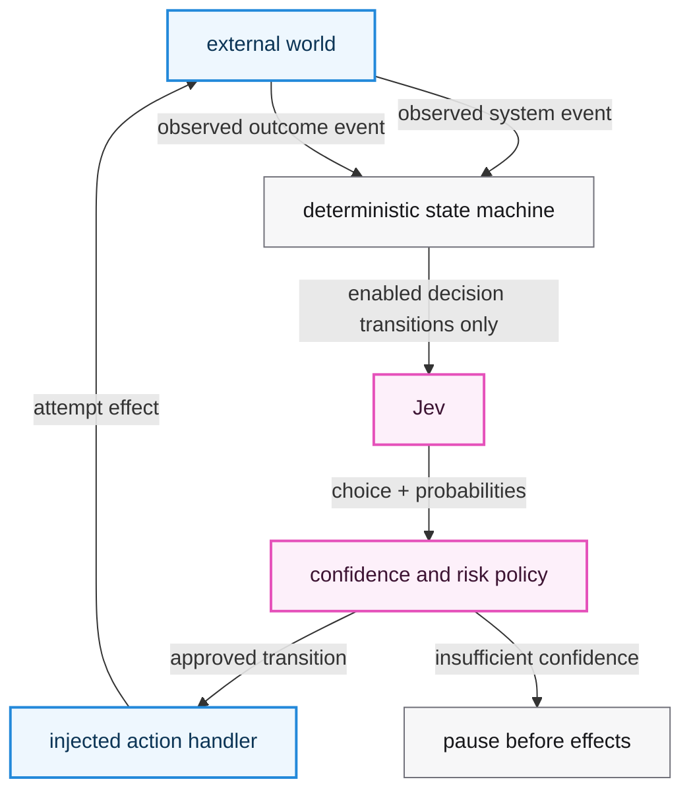
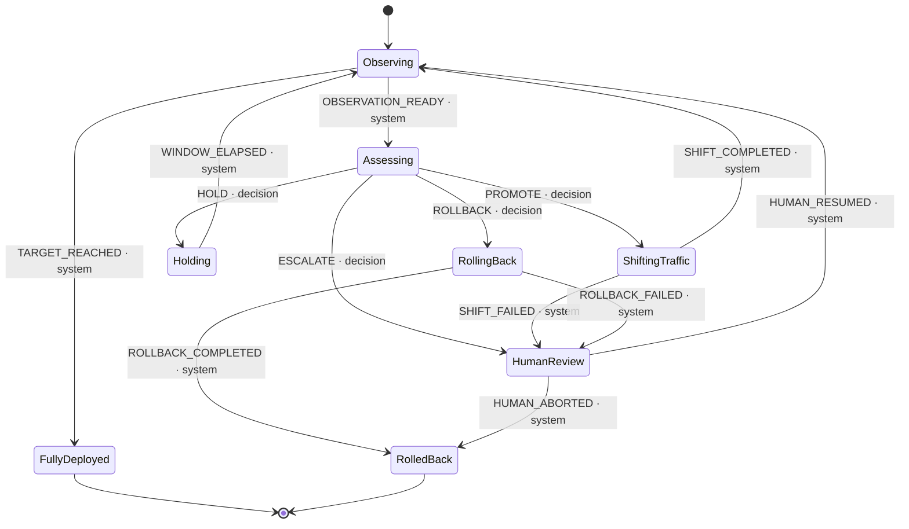
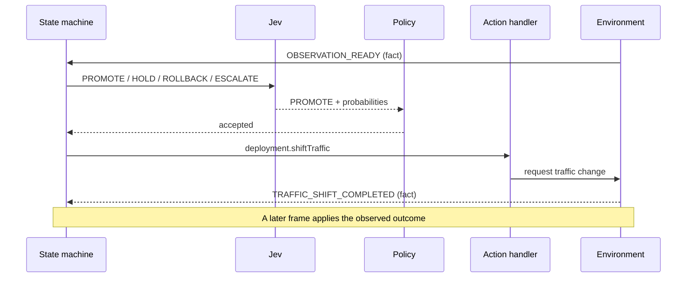

import ArticleBreakout from '@/components/ArticleBreakout.astro';
import DeploymentTraceExplorer from '@/components/DeploymentTraceExplorer.astro';
import healthy from '@/data/jev-deployment-traces/healthy-canary-live.json';
import regression from '@/data/jev-deployment-traces/clear-regression-live.json';
import transient from '@/data/jev-deployment-traces/transient-noise-uncertain-live.json';
import conflicting from '@/data/jev-deployment-traces/conflicting-signals-live.json';
import freeze from '@/data/jev-deployment-traces/change-freeze-live.json';

export const deploymentTraces = [regression, transient, freeze, conflicting, healthy];

In my [first Jev article](/blog/2026/09/18/jev-doesnt-write-review-comments), I reached a simple conclusion: Jev works best when the application—not the model—defines what can happen next.

> **State construction and action-space design are part of model correctness.**

That is straightforward when the decision is the final output. But what happens when it is only one step in a process that continues over time?

My answer is to put Jev inside a state machine.

The machine represents the plan, remembers where execution is, exposes only the transitions currently allowed, and waits for real outcomes before continuing. Jev appears only when the machine reaches a state with several legitimate next decisions. It weighs the current evidence and chooses among those enabled branches.

This makes the composed system agentic without making the model sovereign. Deterministic guards decide which transitions are legal. Code decides whether confidence is sufficient. Injected handlers perform effects. Tools, users, timers, and the external environment report what actually happened.

To make the idea executable, I needed a workflow with ambiguous decisions, consequential actions, delayed outcomes, and hard safety constraints. I used a **simulated canary deployment** as that example. It is not the premise of the design, and no production deployment was controlled. It is a test case for the more general architecture.

# The boundary in one picture

Here is the general architecture. The pink path is judgment. The blue path is fact.



This is deliberately not “put an LLM in a loop and give it tools.” Jev has one job: when the current state has several legal, agent-controlled transitions, select one of them. The state machine—not Jev—is the durable agent loop.

Everything else has a different owner.

| Question | Owner |
| --- | --- |
| What state are we in? | State-machine snapshot |
| Which transitions are legal? | Definition + deterministic guards |
| Which legal response best fits the evidence? | Jev |
| Is the result safe enough to execute? | Runtime policy |
| How is the action performed? | Injected handler |
| Did the action actually succeed? | Tool, user, timer, or environment |

# The machine is the agent

An agent needs continuity: a representation of where it is, what may happen next, what has already happened, and when it must wait for the world. In this design, those responsibilities belong to the state machine.

Jev does not generate a plan or invent the next tool call. It supplies bounded judgment at authored branch points. That division produces a useful composition:

```text
state machine = plan + memory + legal transitions + waiting
Jev           = contextual judgment among enabled decisions
runtime       = policy + effects + verified external outcomes
```

## A concrete example: deciding a canary rollout

To test that composition, I needed more than a toy choice. The example had to require repeated judgment, perform consequential actions, wait for outcomes, and preserve rules the model could not override. A canary rollout has exactly that shape.

The simulation starts a release at 5% of traffic. Each telemetry window reports facts such as baseline and canary error rates, p95 latency, request volume, and recent trend. The machine records that observation and enters an `assessing` state. Only there does it ask Jev to judge what should happen next.

At that branch, the controller may expose up to four decisions:

- `PROMOTE` increases canary traffic;
- `HOLD` keeps traffic where it is and requests another observation window;
- `ROLLBACK` returns traffic to the stable version;
- `ESCALATE` pauses automation for human review.

The list changes with the state. During a change freeze, for example, `PROMOTE` is absent. After the observation budget is exhausted, V3 leaves only `ESCALATE`, so the one-choice rule bypasses Jev. These are authored transitions in a serializable machine definition rather than free-form commands emitted by the model.

Canary deployment is only the worked example. The same split applies anywhere a process has known states and bounded decisions: incident response, approvals, support routing, browser interaction, or recovery workflows.



The graph does more than document the workflow. It is the authority boundary.

For example, promotion has a guard requiring enough canary requests, adequate data quality, no change freeze, and traffic below 100%. A high-risk rollback is also removed, forcing the machine toward human review instead. Guards run **before** the list of choices is constructed. Jev cannot select a transition it never receives.

The runtime then enforces a second boundary:

```ts
const choices = decisionChoices(machine, snapshot, goal, guards);

if (choices.length === 1) {
  selection = deterministicSelection(choices[0]); // no Jev call
} else {
  selection = await evaluator.choose({ goal, snapshot, choices });
}

if (!choices.some(({ event }) => event === selection.event)) {
  throw new Error(`evaluator chose disabled event: ${selection.event}`);
}

if (!policy.accepts(selection)) {
  return { status: 'low-confidence', pendingDecision: selection };
}

return executeTransition(selection.event);
```

A one-choice branch bypasses the model. A disabled answer is rejected. A low-confidence answer pauses before its action. These are runtime invariants, not instructions hidden in a prompt.

# Decisions and facts must be different types

The easiest way for an agent loop to lie is to blur an intended action with its outcome.

Suppose Jev chooses `PROMOTE`. That means “attempt to increase traffic,” not “traffic increased.” The traffic-shift handler may fail. Even if it succeeds, the state machine should move only after the environment reports `TRAFFIC_SHIFT_COMPLETED`.

The trace therefore keeps the two moments separate:



`TRAFFIC_SHIFT_COMPLETED`, `ROLLBACK_COMPLETED`, and `TARGET_REACHED` never appear in Jev's choice list. They are `system` events accepted only from the host. The same distinction applies outside deployments: “send email” is a decision; “email delivered” is an observed outcome.

# Replay the captured traces

The visualization below contains five reviewed traces from the original live `jev-1.13.0` matrix over synthetic telemetry. It does not call a model or require credentials. Select a scenario, step through its timeline, and watch the graph, evidence, probabilities, and policy result change together.

Start with **Clear regression**. Then compare **Transient noise** and **Change freeze**: those are the two cases where the surrounding machine matters most.

<ArticleBreakout>
  <DeploymentTraceExplorer traces={deploymentTraces} />
</ArticleBreakout>

There is also a [full-width standalone version](/demos/jev-deployment-state-machine) for smaller screens or side-by-side inspection.

# What the simulation showed

The experiment used eight synthetic scenarios, three seeds, and three repetitions per seed: 72 runs in each matrix. It is not a deployment benchmark.

| Measurement | V1 | V2 | V3 |
| --- | ---: | ---: | ---: |
| Jev decisions | 106 | 113 | 104 |
| Runs reaching an authored terminal outcome | 20 | 40 | 36 |
| Low-confidence runs | 52 | 32 | 22 |
| Input tokens | 88,920 | 213,039 | 174,578 |
| Mean decision latency | 285.3 ms | 274.1 ms | 263.2 ms |

“Authored terminal outcome” means the final status matched one small canonical fixture path. It is not an accuracy measure. V3 made that limitation especially visible: safe escalations sometimes disagreed with fixtures that preferred continued automation.

The useful findings fit into four cases:

1. **Clear evidence produced a clear judgment.** Clear regression chose `ROLLBACK` and completed in all nine runs in every design.
2. **Uncertainty stopped consequential actions.** In V1, all nine transient-noise runs chose `ROLLBACK` at only `0.26–0.44` confidence, so none executed it.
3. **The machine enforced authority independently of Jev.** During a change freeze, a guard removed `PROMOTE`. Jev selected it zero times because it was not an available answer.
4. **State representation changed the judgment.** When V3 replaced `trend: improving` with the numeric recovery sequence, all nine transient runs selected `HOLD` first at `0.80–0.86` confidence.

## Confidence policy must reflect the transition

The first policy used one confidence floor (`0.50`) and one top-two margin (`0.05`) for every decision. It paused 52 of 72 runs, including harmless holds and requests for human review. That exposed the key design mistake: [confidence describes how concentrated a Choice distribution is](https://docs.typesafe.ai/confidence); it does not say whether an action is safe or authorized.

The transition-aware policy combines the selected action with uncertainty:

| Transition | Minimum confidence | Minimum margin |
| --- | ---: | ---: |
| `PROMOTE` | 0.60 | 0.10 |
| `ROLLBACK` | 0.60 | 0.10 |
| `HOLD` | 0 | 0 |
| `ESCALATE` | 0 | 0 |

Under V2, every low-confidence stop involved `PROMOTE` or `ROLLBACK`; no `HOLD` or `ESCALATE` stopped for low confidence. Healthy canaries completed in six of nine runs instead of two, while clear regressions still rolled back in all nine.

This was not a clean win. V2 still misread eight of nine transient cases as rollback, and all nine sparse-evidence runs did the same. Input usage also more than doubled because structured criteria were repeated on every call.

## V3: give Jev the trajectory, not a label

The V2 transient state contained one currently bad window plus the summary `trend: improving`. More instructions repeated that claim, but they did not provide the evidence behind it.

V3 carries at most four numeric telemetry samples ordered oldest to newest. The transient fixture starts with this sequence:

| Sample | Canary errors | Canary p95 |
| ---: | ---: | ---: |
| 1 | 12.110% | 599.3 ms |
| 2 | 7.618% | 431.0 ms |
| 3 | 5.259% | 309.9 ms |

The canary is still worse than baseline, but the recovery is now part of the state rather than an adjective.

That changed the targeted decision: **all nine V3 transient runs chose `HOLD` first**, with confidence from `0.80` to `0.86`. V2 produced eight uncertain rollbacks and one hold.

It did not make the whole rollout autonomous. After the next healthy window, all nine selected `PROMOTE` at only `0.42–0.57` confidence. The `0.60` gate stopped every promotion. V3 fixed temporal interpretation at the branch it targeted; it did not establish end-to-end deployment success.

Shorter criteria also reduced input tokens per decision from 1,885.3 in V2 to 1,678.6 in V3, an 11.0% reduction. Overall input fell 18.1%, partly because the trajectories made fewer Jev calls.

Other V3 changes strengthened the machine rather than the prompt:

- observation-budget exhaustion leaves only `ESCALATE`, so Jev is bypassed;
- the hard step limit applies before both decision and system transitions;
- context delivered with a system event is committed only after the event is validated;
- the transition-aware confidence policy remains unchanged.

# The useful unit is the composed system

Jev is valuable after code has enforced the hard rules, where evidence remains contextual: errors are elevated but improving, latency and errors disagree, or baseline and canary fail together. Those cases can become an increasingly brittle threshold tree. A bounded Choice lets the model weigh them without taking over control flow.

This pattern fits workflows with known states, a finite set of meaningful next actions, and observable outcomes: incident response, approvals, support routing, browser interaction, and recovery workflows. It does not fit when the action itself must be invented or success cannot be observed.

The V3 result is encouraging but narrow. Numeric history fixed the transient branch, while healthy promotion remained uncertain. Lowering the threshold after seeing these captures would be tuning against the test set. The next evaluation should freeze safe, unsafe, and preferred action sets and test policy changes on new cases.

The clearest result is still architectural: a freeze made promotion impossible, uncertain traffic-changing actions stopped before effects, and factual outcomes remained outside the model's vocabulary.

That is the design: **the state machine supplies continuity and authority; Jev supplies judgment at the branches.**
